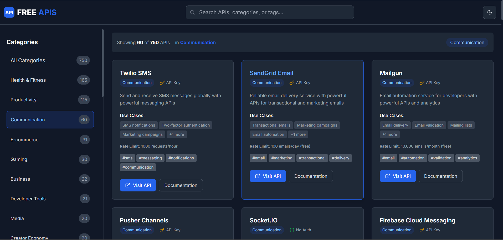

// Update: Update README with examples
// Update: Update README with examples
// Update: Update API documentation
// Update: Update API documentation
// Update: Update README with examples
// Update: Update README with examples
# 🚀 Free APIs Directory

A comprehensive, modern directory of **1000+ free public APIs** for developers. Built with Next.js 13, TypeScript, and Tailwind CSS, featuring a beautiful dark/light mode interface and advanced filtering capabilities.



## ✨ Features

- 🎯 **1000+ Curated APIs** across 20+ categories
- 🔍 **Advanced Search** - Search by name, description, category, or tags
- 📱 **Responsive Design** - Perfect on desktop, tablet, and mobile
- 🌙 **Dark/Light Mode** - Beautiful themes with smooth transitions
- 🏷️ **Smart Filtering** - Filter by category and authentication type
- ⚡ **Fast Performance** - Built with Next.js 13 and optimized for speed
- 🎨 **Modern UI** - Clean, professional interface with smooth animations
- 📊 **Real-time Stats** - Live filtering statistics and counts
- 🔐 **Authentication Info** - Clear indicators for API authentication requirements
- 📖 **Detailed Information** - Rate limits, use cases, and documentation links

## 🛠️ Tech Stack

- **Framework**: Next.js 13 (App Router)
- **Language**: TypeScript
- **Styling**: Tailwind CSS
- **UI Components**: Radix UI + shadcn/ui
- **Icons**: Lucide React
- **Animations**: Framer Motion
- **Theme**: next-themes
- **Deployment**: Static Export Ready

## 🚀 Quick Start

### Prerequisites

- Node.js 18+ 
- npm or yarn

### Installation

1. **Clone the repository**
   ```bash
   git clone https://github.com/shivas1432/free-apis-application.git
   cd free-apis-application
   ```

2. **Install dependencies**
   ```bash
   npm install
   # or
   yarn install
   ```

3. **Start development server**
   ```bash
   npm run dev
   # or
   yarn dev
   ```

4. **Open your browser**
   ```
   http://localhost:3000
   ```

## 📁 Project Structure

```
free-apis-directory/
├── app/
│   ├── components/          # React components
│   │   ├── Header.tsx       # Navigation header
│   │   ├── Sidebar.tsx      # Category & filter sidebar
│   │   ├── ApiGrid.tsx      # API cards grid
│   │   ├── ApiCard.tsx      # Individual API card
│   │   ├── StatsBar.tsx     # Statistics display
│   │   └── ThemeToggle.tsx  # Dark/light mode toggle
│   ├── types/
│   │   └── api.ts           # TypeScript interfaces
│   ├── globals.css          # Global styles
│   ├── layout.tsx           # Root layout
│   └── page.tsx             # Main page component
├── data/
│   ├── apis.json            # Main APIs dataset (250 APIs)
│   ├── apis1.json           # Additional APIs (500 APIs)
│   └── apis2.json           # More APIs (250 APIs)
├── lib/
│   └── utils.ts             # Utility functions
├── components/ui/           # shadcn/ui components
└── demo/
    └── image.png            # Demo screenshot
```

## 🎨 API Categories

Our directory includes APIs across these categories:

- 🌤️ **Weather & Climate** - Weather data, forecasts, climate info
- 💰 **Finance & Crypto** - Stock prices, crypto data, payment processing
- 🛠️ **Developer Tools** - GitHub, CI/CD, code analysis, deployment
- 📱 **Social Media** - Twitter, Instagram, LinkedIn, TikTok APIs
- 📰 **News & Media** - News aggregation, media content, journalism
- 🎮 **Entertainment** - Movies, music, games, streaming platforms
- 🗺️ **Maps & Location** - Mapping, geocoding, navigation, places
- 🛒 **E-commerce** - Shopping, payments, inventory, marketplaces
- ⚽ **Sports** - Live scores, player stats, team information
- 💪 **Health & Fitness** - Nutrition, exercise, wellness tracking
- 🍕 **Food & Recipes** - Recipe databases, nutrition facts, restaurants
- ✈️ **Travel** - Flights, hotels, destinations, booking platforms
- 📚 **Education** - Learning platforms, courses, academic resources
- 🔬 **Science & Tech** - Research data, space APIs, AI/ML services
- 💼 **Business** - CRM, productivity, communication, analytics

## 🔧 Available Scripts

```bash
# Development
npm run dev          # Start development server
npm run build        # Build for production
npm run start        # Start production server
npm run lint         # Run ESLint

# Type checking
npm run type-check   # Run TypeScript compiler
```

## 🌐 Deployment

This project is configured for static export and can be deployed to any static hosting service:

### Vercel (Recommended)
```bash
npm run build
# Deploy the 'out' folder to Vercel
```

### Netlify
```bash
npm run build
# Deploy the 'out' folder to Netlify
```

### GitHub Pages
```bash
npm run build
# Deploy the 'out' folder to GitHub Pages
```

## 🤝 Contributing

We welcome contributions! Here's how you can help:

1. **Fork the repository**
2. **Create a feature branch** (`git checkout -b feature/amazing-feature`)
3. **Add new APIs** to the appropriate JSON file
4. **Follow the API schema**:
   ```json
   {
     "id": "unique-id",
     "name": "API Name",
     "description": "Brief description",
     "category": "Category Name",
     "useCases": ["use case 1", "use case 2"],
     "url": "https://api.example.com",
     "documentation": "https://docs.example.com",
     "authentication": "none|key|oauth",
     "rateLimit": "1000 requests/hour",
     "tags": ["tag1", "tag2"]
   }
   ```
5. **Commit your changes** (`git commit -m 'Add amazing feature'`)
6. **Push to the branch** (`git push origin feature/amazing-feature`)
7. **Open a Pull Request**

## 📊 API Statistics

- **Total APIs**: 1000+
- **Categories**: 20+
- **No Authentication**: 400+ APIs
- **API Key Required**: 450+ APIs
- **OAuth Required**: 150+ APIs
- **Free Tier Available**: 95%+ APIs

## 📝 License

This project is licensed under the MIT License - see the [LICENSE](LICENSE) file for details.

## 👨‍💻 Developer

**Kanugula Shivashanker**
- 🌐 Website: [shivashanker.com](https://www.shivashanker.com)
- 💼 LinkedIn: [linkedin.com/in/shivashanker-kanugula](https://www.linkedin.com/in/shivashanker-kanugula-51a512252)
- 🐙 GitHub: [github.com/shivas1432](https://github.com/shivas1432)
- 📧 Email: shivas1432@gmail.com
- 🛠️ Portfolio: [t.me/helpme_coder](https://t.me/helpme_coder)

**About Me:**
Full-Stack Developer | React, Node.js, Express, MySQL | Passionate about building dynamic web apps | Continuous learner | Open to collaboration.

## 🙏 Acknowledgments

- Thanks to all API providers for making their services publicly available
- [shadcn/ui](https://ui.shadcn.com/) for the beautiful UI components
- [Lucide](https://lucide.dev/) for the amazing icons
- [Tailwind CSS](https://tailwindcss.com/) for the utility-first CSS framework
- [Next.js](https://nextjs.org/) team for the incredible React framework

## 📈 Roadmap

- [ ] Add API testing functionality
- [ ] Implement user favorites system
- [ ] Add API comparison feature
- [ ] Create mobile app version
- [ ] Add API monitoring dashboard
- [ ] Implement user reviews and ratings
- [ ] Add API changelog tracking
- [ ] Create developer blog section

---

⭐ **Star this repository if you find it helpful!**

Made with ❤️ by **Kanugula Shivashanker**


